# Niveles realizados: 1
## Nivel 1:
### Salida ejemplo:
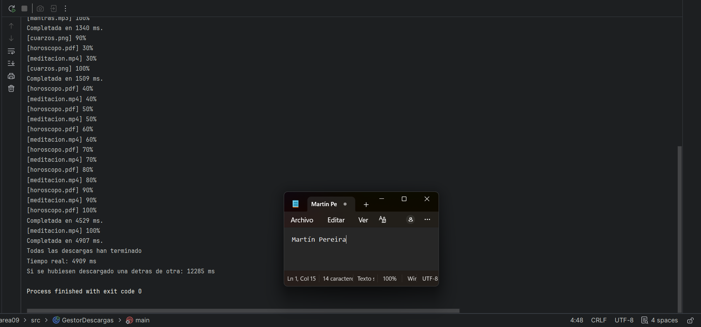

### Tabla:
#### Ejecucion 1:
Descarga mas lenta:  
meditacion.mp4 - 4759 ms  
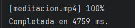

Timepo real (ms):  
4762ms  
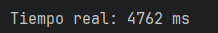

Suma (ms):   
16346 ms  
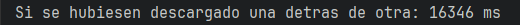

#### Ejecución 2:
Descarga mas lenta:  
cuerzos.mp4 - 3451 ms  
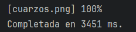

Timepo real (ms):  
3453 ms   
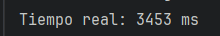

Suma (ms):   
12401 ms  
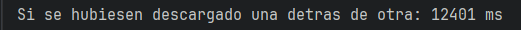

#### Ejecución 3:
Descarga mas lenta:  
meditacion.mp4 - 4940 ms  
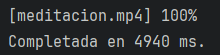

Timepo real (ms):  
4942 ms  

Suma (ms):   
15071 ms  
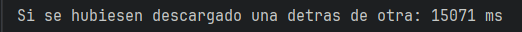

### ¿Por qué el tiempo real es mucho menor que la suma?
Esto se debe a que el tiempo real es el tiempo en el que los 4 hilos terminan de funcionar, mientras que la suma sería la suma de los 4 hilos si se hiciese de manera individual.

### ¿Qué pasa si hacéis start() y join() dentro del mismo bucle? Probadlo y poned el tiempo real que os sale.
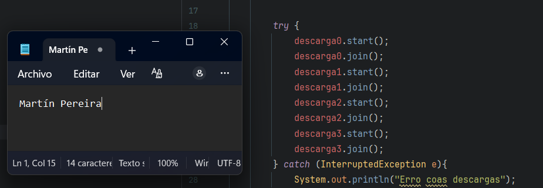  
Lo que pasa en este caso es que primero tiene que ejecutarse un hilo para poder empezar el siguiente, por lo que se rompe la paralelidad:   
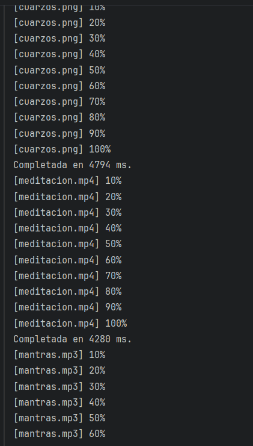

## Declaracion de uso de IA: 
Para esta tarea usé claude ya que no entiendia la diferencia entre el tiempo total y la suma. Para ello la consulte y saqué las lineas de codigo para poder obtener el tiempo total.

